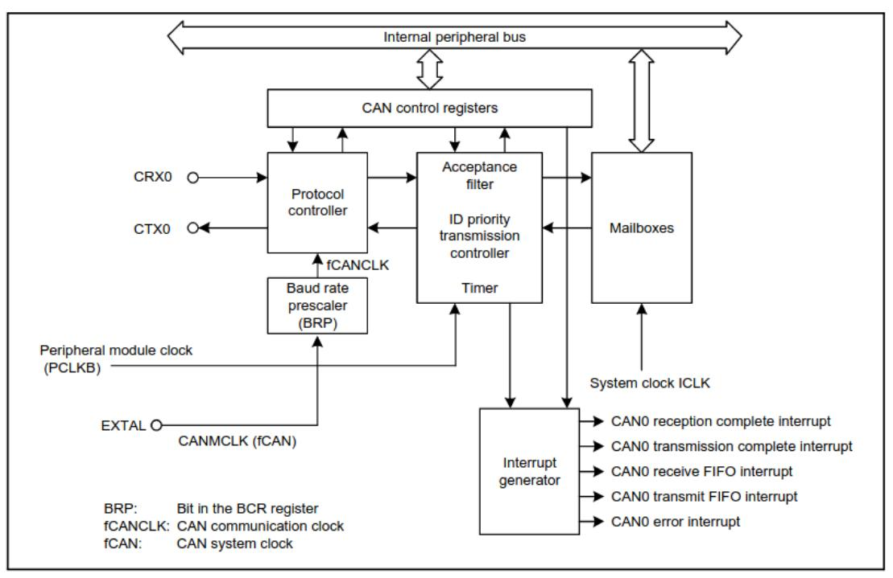
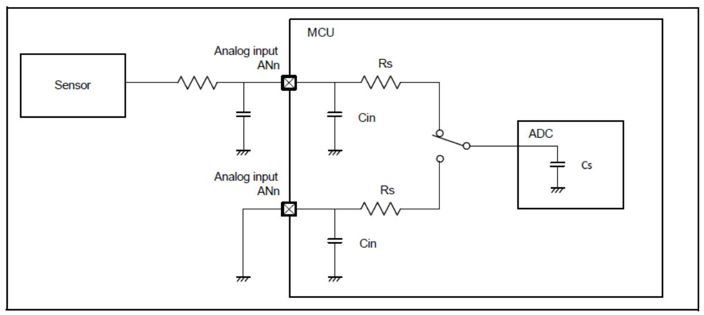

# Smart Battery System

### <https://github.com/AERPAW/sbs> Подключите свой аккаунт Github

### TODO List

- 1. Convert text description of behavioral flowchart to a diagram/picture
- 2. Determine what resistors to use for voltage diff amps
- 3. Determine if ideal diode FETs are same as those in the high-current FET array
- 4. Map MCU pins to board functions
- 5. Determine if MCU GPIOs go high impedance when MCU goes to sleep
  - a.If yes, configure pull-up/down resistors on control signals for sleep state
- 6. Look for cell voltage measurement amps for 12S levels
  - a. See if anything else is incompatible
    - i. Will need to move shunt to low-side measurement
  - b. Don't limit to parts with a shutdown pin
- 7. Determine resistor divide ratios for VOUT\_DIVIDED and VSTACK\_DIVIDED
  - a. Add zener clamps to these as well
- 8. Determine if cell voltage diff amps should use Vref=1.3V resistor ratios or if Vref=1.6 is ok
- 9. Add pull-ups to I2C if needed
- 10. Measure the average power consumption of the SBS write that into the MCU ROM

# Requirements

- [Interface](https://aerpaw-uav.atlassian.net/l/cp/KRZx15VE)
  - Battery CANBUS & Balance connector
    - CANBUS and I2C connections
      - Must be opto-isolated because, when stacking multiple 6S SBS, each module's "ground" is not 0 V to the Cube, but a sum of all the battery stack voltages below it
      - CAN must be capable of 5 Mbps (future systems may use high-speed CAN FD) ( [CA](https://www.can-cia.org/index.php?id=systemdesign-can-physicallayer#high) N in [Automation](https://www.can-cia.org/index.php?id=systemdesign-can-physicallayer#high) (CiA) )
    - Cell voltages (C\_n) feed directly to the battery charger
      - These shall function if no component is populated on the SBS PCB
      - The 6S SBS uses only C\_1 through C\_6, so C\_7 through C\_12 are "no connects"

- Detect\_OUT and Detect\_IN will be connected by the Host
- The Host is responsible for connecting the cells, CAN, I2C, 5V, GND, and Detect pins properly
- Battery High Current
  - The load capacitance may be estimated to be a maximum of 6000 uF
- Shall contain a separate header on the PCB for UART debugging
- Shall measure each cell voltage and the entire stack voltage
- Shall measure the battery current in the range [-190, 190] A
  - Needs higher precision at smaller currents [-1, 1] A because it can spend a long time supplying a small currents
- Shall measure the voltage on the output terminals
  - Determines whether connected to charger
- Shall provide an ideal diode setup for low current (drone on ground) setups to allow for hotswapping battery stacks
  - The ideal diode setup shall enable inrush control and load switching
  - Shall be able to enforce a maximum current through the ideal diode 10 A (the limit is configurable by the firmware - use the current amplifiers and compare to a constant)
  - Shall limit the inrush current to 10 A (same as max current listed above)
- Shall allow for regenerative braking (reverse current to charge batteries) while drone in flight
- Shall contain a NTC thermistor for temperature measurement/reporting by software
- Shall contain a piezo
  - Low battery warning
- Shall contain a RGB LED for SoC indication
  - If easy enough, have several DNP LEDs in a row for indicating SoC (more intuitive)
- Shall read a resistance across Detect\_OUT ↔︎ Detect\_IN to indicate operation modes
  - Resistance 0 (short) means connected to charger
  - Resistance 4.7k means connected to 12S drone
  - Resistance 2.2k means connected to 6S drone
  - Open means nothing is connected

# Software Notes

- e^2 studio: e² [studio](https://www.renesas.com/us/en/software-tool/e-studio)
  - Install Synergy Software Package Renesas [Synergy™](https://www.renesas.com/us/en/products/microcontrollers-microprocessors/renesas-synergy-platform-mcus/renesas-synergy-software-package) Software Package (SSP)

- DK-S128 S128 [Development](https://www.renesas.com/us/en/products/microcontrollers-microprocessors/renesas-synergy-platform-mcus/rtk7dks128s00001bu-dk-s128-development-kit) Kit
- [High-level](https://www.renesas.com/us/en/document/qsg/development-kit-s128-dk-s128-quick-start-guide?r=1261681) overview
- Detailed [description](https://www.renesas.com/us/en/document/mat/development-board-kit-s128-dk-s128-users-manual-v20?r=1261681)
- Board [design](https://www.renesas.com/us/en/document/pcs/renesas-synergy-development-kit-dk-s128-v20-design-data?r=1261681) data (we have rev. 2)

# MCU Notes

## Pin Mappings

- Can probably simplify the shutdown/enable signals, but leaving this open as a placeholder
- Place Detect\_OUT driver and Detect\_IN resistor divider reading close together

| Pin Type | Signal                           | Port                                                                                                                                   | Notes                                                                                                                                                                                                                                                                                                                                                                 |
|-------------|----------------------------------|----------------------------------------------------------------------------------------------------------------------------------------|-----------------------------------------------------------------------------------------------------------------------------------------------------------------------------------------------------------------------------------------------------------------------------------------------------------------------------------------------------------------------|
| ADC         | AN000AN01 3 AN016AN02 2 | P000P004, P010P015, P500P502, P100P106                                                                                        | "Pins AN000 to AN013 cannot be used as general I/O, IRQ2 input, or for TS transmission when the A/D converter is in use." (S128 Datasheet Table 2.48) Therefore, pins with the functions AN000AN013 shall be selected for ADC inputs AN016AN022. |
| GPIO        | n/a                              | P000P004, P010P015, P100P113, P201, P204P206, P212P213, P300P304, P400P403, P407P411, P500P502, P914P915 |                                                                                                                                                                                                                                                                                                                                                                       |
| GPI         |                                  | P200, P214P215                                                                                                                      |                                                                                                                                                                                                                                                                                                                                                                       |
| IRQ         | IRQ0IRQ7                         |                                                                                                                                        |                                                                                                                                                                                                                                                                                                                                                                       |

| Type   | Function                                    | Quanti ty | Pin(s) MCU                                                                                                                                                                                            |
|--------|---------------------------------------------|--------------|----------------------------------------------------------------------------------------------------------------------------------------------------------------------------------------------------------|
| ADC    | Shunt amplifier reading               | 4            | I_FORWARD_HIGHRANGE: AN003 (P003) I_FORWARD_LOWRANGE: AN002 (P002) I_REVERSE_HIGHRANGE: AN001 (P001) I_REVERSE_LOWRANGE: AN000 (P000)                                   |
| ADC    | Cell voltage reading                  | 6            | MCU_VCELL6: AN012 (P501) MCU_VCELL5: AN011 (P502) MCU_VCELL4: AN010 (P015) MCU_VCELL3: AN009 (P014) MCU_VCELL2: AN008 (P013) MCU_VCELL1: AN007 (P012) |
| ADC    | Thermistor reading                       | 1            | VTHERM: AN017 (P105)                                                                                                                                                                               |
| ADC    | Detect_IN resistor divider reading | 1            | Detect_IN: AN016 (P106)                                                                                                                                                                            |
| ADC    | VOUT_DIVIDED reading                     | 1            | VOUT_DIVIDED: AN004 (P004)                                                                                                                                                                         |
| ADC    | VSTACK_DIVIDED reading                   | 1            | VSTACK_DIVIDED: AN013 (P500)                                                                                                                                                                       |
| Serial | CAN0                                        | 1            | SBS_CAN_RX: CRX0_C (P102) (46) SBS_CAN_TX: CTX0_C (P103) (45)                                                                                                                       |
| Serial | I2C1                                        | 1            | SBS_I2C_SDA: SDA1_B (P101) (47) SBS_I2C_SCL: SCL1_B (P100) (48)                                                                                                                     |
| Serial | UART                                        | 1            | SBS_UART_RX: RXD9_B (P110) (35) SBS_UART_TX: TXD9_B (P109) (34)                                                                                                                     |
| Serial | JTAG (programming/debug)                 | 1            | SWCLK: SWCLK (P300) (32) SWDIO: SWDIO (P108) (33)                                                                                                                                   |
| GPIO   | RGB LED                                  | 3            | RGB_BLUE: (P302) (30) RGB_RED: (P303) (29) RGB_GREEN: (P304) (28)                                                                                                                |

| GPIO | Piezo                                       | 1                     | PIEZO: (P206) (22)                    |
|------|---------------------------------------------|-----------------------|---------------------------------------------|
| GPIO | SHDN_CELL_VMEASURE (active high)      | 1                     | SHDN_CELL_VMEASURE: (P104) (44)       |
| GPIO | EN_CURRENT_SENSE (active high)        | 1                     | EN_CURRENT_SENSE: (P401) (2)          |
| GPIO | EN_IDEAL_DIODE (active high)          | 1                     | EN_IDEAL_DIODE: (P113) (38)           |
| GPIO | EN_FET_ARRAY (active high)            | 1                     | EN_FET_ARRAY: (P111) (36)             |
| GPIO | ~{SHDN_FET_ARRAY_DRIVER} (active low) | 1                     | ~{SHDN_FET_ARRAY_DRIVER}: (P112) (36) |
| GPIO | Debug/state-of-charge LEDs               | min 4, max 8 | no mapping                               |
| GPIO | Detect_OUT driver                        | 1                     | Detect_OUT: (P107) (41)               |

### CAN Communication

8. Hardware design [recommendations](https://legacy.uavcan.org/Specification/8._Hardware_design_recommendations/) - UAVCAN

## Analog Voltages / ADC

Maximum pin voltages

| Parameter                 |                                              | Symbol           | Value                     | Unit |
|---------------------------|----------------------------------------------|------------------|---------------------------|------|
| Power supply voltage      |                                              | VCC              | -0.5 to +6.5              | V    |
| Input voltage             | 5 V tolerant ports*1                         | V in  | -0.3 to +6.5              | V    |
|                           | P000 to P004 P010 to P015 P500 to P502 | V in  | -0.3 to AVCC0 + 0.3       | V    |
|                           | Others                                       | V in  | -0.3 to VCC + 0.3         | V    |
| Reference power supply v  | voltage                                      | VREFH0           | -0.3 to +6.5              | V    |
| Analog power supply volta | age                                          | AVCC0            | -0.5 to +6.5              | V    |
| USB power supply voltage  | 9                                            | VCC_USB          | -0.5 to +6.5              | V    |
|                           |                                              | VCC_USB_LDO      | -0.5 to +6.5              | V    |
| Analog input voltage      | When AN000 to AN013 are used                 | V AN  | -0.3 to AVCC0 + 0.3       | V    |
|                           | When AN016 to AN022 are used                 |                  | -0.3 to VCC + 0.3         | V    |
| Operating temperature*2   | 3                                            | T opr | -40 to +85 -40 to +105 | °C   |
| Storage temperature       |                                              | T stg | -55 to +125               | °C   |

- Consulting the S128 User Manual section 1.7 (Pin Lists) shows the ports related to AVCC0 are ADC inputs AN000 through AN013
- AN016..AN022 are tolerant of voltages up to VCC
- Reference voltages
  - Internal reference

| Parameter                                                 | Min  | Тур  | Max  | Unit | Test conditions |
|-----------------------------------------------------------|------|------|------|------|-----------------|
| Internal reference voltage input channel* 2 | 1.36 | 1.43 | 1.50 | V    | -               |
| Frequency*3                                               | 1    | -    | 2    | MHz  | -               |
| Sampling time*4                                           | 5.0  | -    | -    | μs   | -               |

#### S128 User Manual Table 46.49

Internal reference experiment

Variation in internal reference may be more subject to temperature and AVCC0 than random noise

| External | references | are an | option ( | AVCC0 | and | VREFH0 | ) |
|----------|------------|-----------|-------------|-------|-----|--------|---|
|          |            |           |             |       |     |        |   |

| Analog power supply voltages | AVCC0*1, *2 |                 | 1.6 | - | 5.5   | V |
|------------------------------|-------------|-----------------|-----|---|-------|---|
|                              | AVSS0       |                 | -   | 0 | -     | V |
|                              | VREFH0      | When used as    | 1.6 | - | AVCC0 | V |
|                              | VREFL0      | ADC14 Reference | -   | 0 | -     | V |

S128 Datasheet Table 2.2 (Recommended operating conditions : min, typ, max, unit)

- AVCC0 is the analog block supply rail
  - Refer to the SBS [Design](https://aerpaw-uav.atlassian.net/l/cp/8C2nr3wA) "Analog Power" section for the value
- VREFH0 is an optional high-side external reference can be supplied in case the internal reference isn't accurate enough
  - This voltage cannot go below 1.6 V, so supplying a 'more stable 1.45 V' is unfortunately not an option

Modeling ADC inputs

Figure 2.62 from MCU [Datasheet](https://www.renesas.com/us/en/document/dst/s128-microcontroller-group-datasheet)

| Parameter                  |     | Min | Тур | Max                  | Unit | Test Conditions          |
|----------------------------|-----|-----|-----|----------------------|------|--------------------------|
| Frequency                  |     | 1   | -   | 64                   | MHz  | -                        |
| Analog input capacitance*2 | Cs  | -   | -   | 8 (reference data)   | pF   | High-precision channel   |
|                            |     | -   | -   | 9 (reference data)   | pF   | Normal-precision channel |
| Analog input resistance    | Rs  | -   | -   | 2.5 (reference data) | kΩ   | High-precision channel   |
|                            |     | -   | -   | 6.7 (reference data) | kΩ   | Normal-precision channel |
| Analog input voltage range | Ain | 0   | -   | VREFH0               | ۷    | -                        |

Table 2.41 from MCU [Datasheet](https://www.renesas.com/us/en/document/dst/s128-microcontroller-group-datasheet)

| Parameter                                  |                                                           | Symbol           | Min | Тур | Max | Unit | Test conditions                                  |
|--------------------------------------------|-----------------------------------------------------------|------------------|-----|-----|-----|------|--------------------------------------------------|
| Input leakage current                      | RES, Ports P200, P214, P215                               | I in  | -   | -   | 1.0 | μΑ   | V in = 0 V V in = VCC   |
| Three-state leakage current (off state) | 5V-tolerant ports                                         | I TSI | -   | -   | 1.0 | μΑ   | V in = 0 V V in = 5.8 V |
|                                            | Other ports                                               |                  | -   | -   | 1.0 |      | V in = 0 V V in = VCC   |
| Input pull-up resistor                     | All ports (except for P200, P214, P215, P914, P915) | R U   | 10  | 20  | 50  | kΩ   | V in = 0 V                            |
| Input capacitance                          | USB_DP, USB_DM, P200                                      | C in  | -   | -   | 30  | pF   | V in = 0 V                            |
|                                            | Other input pins                                          |                  | -   | -   | 15  |      | f = 1 MHz T a = 25°C               |

Table 2.10 from MCU [Datasheet](https://www.renesas.com/us/en/document/dst/s128-microcontroller-group-datasheet)

#### Low Power Modes

There are two dimensions to low power functions:

- 1. Low power mode (Sleep, Software Standby, and Snooze modes)
- 2. Power control modes (clock speeds like High-speed, Middle-speed, Low-speed, Low-voltage, and Subosc-speed)

The use of XCIN/XCOUT's 32.768 kHz oscillator enables current draws in the uA in both Normal mode and Sleep mode (S128 Datasheet Table 2.11 (Operating and standby current)).

Concerning the states of I/O ports during sleep, the S128 User Manual Table 10.2 (Operating conditions of each low power mode) specifies:

| Table 1 | 10.2 Operating conditions of                                                                                                                                   | each low power mode (1                                             | of 2)                          |               |
|---------|----------------------------------------------------------------------------------------------------------------------------------------------------------------|--------------------------------------------------------------------|--------------------------------|---------------|
| Param   | eter                                                                                                                                                           | Sleep mode                                                         | Software Standby mode          | Snooze mode*1 |
|         |                                                                                                                                                                |                                                                    |                                |               |
| I/O Po  | rts                                                                                                                                                            | Operating                                                          | Retained                       | Operating     |
| Note:   | Selectable means that operating or n Stop (Retained) means that the control Operation prohibited means that the Otherwise, proper operation is not ou | ents of the internal registers and function must be stopped before | re retained but the operations |               |

This means pull-up/pull-down resistors are not required to enforce default states when the MCU is asleep.